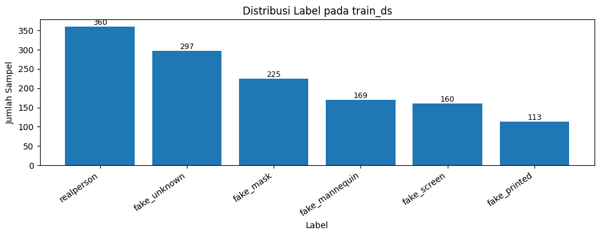
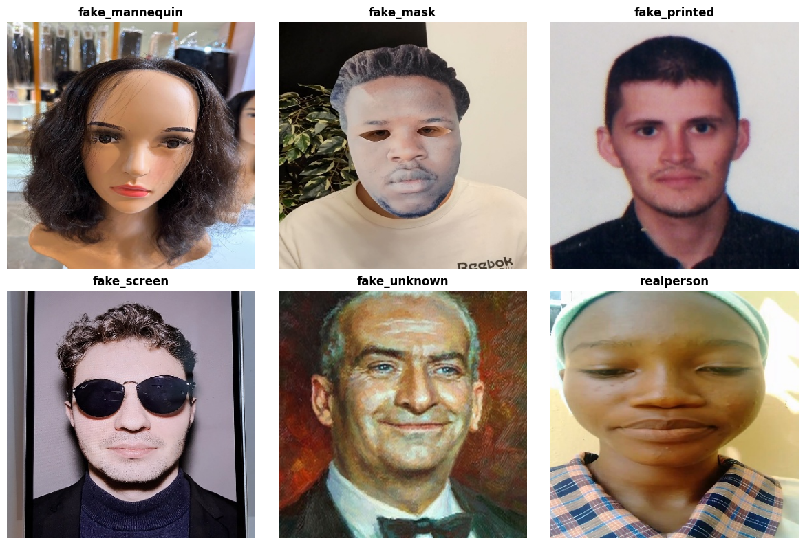
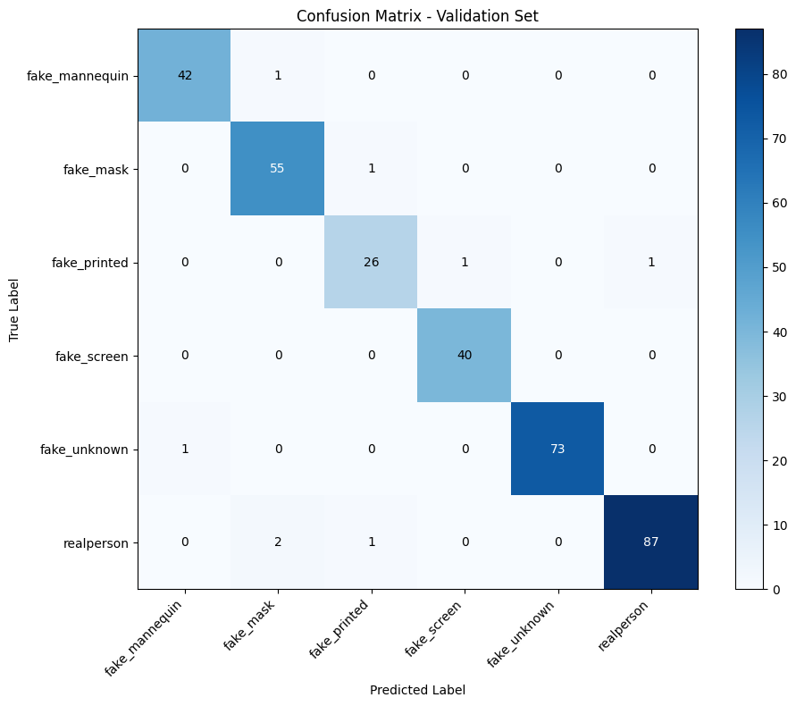
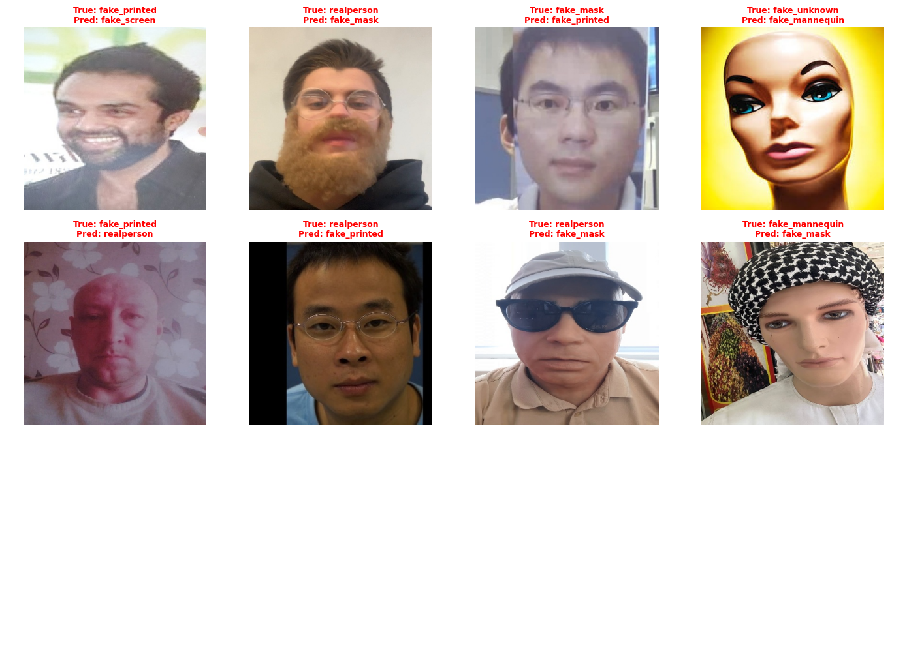

# 🎭 Smart Face Anti-Spoofing

> A comprehensive deep learning solution for detecting face spoofing attacks across 6 distinct attack types.
> Developed as a competition solution for **Find IT UGM 2026**.

[](https://www.python.org/downloads/)
[](https://pytorch.org/)
[](https://huggingface.co/transformers/)
[](LICENSE)

---

## 📋 Overview

This project addresses the critical challenge of **face anti-spoofing** by developing a robust computer vision model capable of distinguishing between genuine faces and various spoofing attacks in real-world conditions.

### 🎯 Competition Objectives

- **Primary Goal**: Build an image-based face classification model that accurately identifies real faces and detects multiple spoofing attack types
- **Evaluation Metric**: **Macro F1-Score** (ensures equal contribution from all classes regardless of imbalance)
- **Real-World Robustness**: Handle variations in lighting, camera angles, and diverse attack methods

### 📸 Dataset Classes

| Class | Description |
|-------|-------------|
| **real_person** | Genuine face images without any manipulation |
| **fake_printed** | Print attack (photo-based spoofing) |
| **fake_screen** | Screen attack (digital display-based) |
| **fake_mask** | 3D mask or silicone mask attacks |
| **fake_mannequin** | Mannequin or replica face attacks |
| **fake_unknown** | Other unclassified spoofing methods |

---

## 🚀 Solution Approach

Our pipeline implements a **multi-stage deep learning architecture** optimized for robust face spoofing detection:

### 1️⃣ Data Preparation
- Download dataset, sample submission, and pre-trained best model from Google Drive
- Extract and validate dataset structure
- Create paired dataset of YOLO-cropped face regions and full-face images
- Implement stratified train-validation split (80-20)

### 2️⃣ Preprocessing & Augmentation Strategy
- **Image Processor**: AutoImageProcessor from DINOv3 backbone
- **Augmentation Pipeline**:
  - RandomResizedCrop, RandomHorizontalFlip
  - ColorJitter, GaussianBlur
  - Random grayscale conversion
  - JPEG compression simulation
  - Low-resolution degradation
  - Gaussian noise injection
- **Training Strategy**: Randomly mix cropped face and full-face images to enhance generalization

### 3️⃣ Model Architecture
- **Backbone**: `facebook/dinov3-convnext-large-pretrain-lvd1689m`
  - State-of-the-art vision transformer pre-trained on large-scale data
- **Classification Head**:
  - Residual adapter for feature transformation
  - Multi-layer perceptron classifier with dropout
- **Loss Function**: Focal Loss (addresses class imbalance)

### 4️⃣ Training Configuration
- **Framework**: Hugging Face Transformers
- **Optimizer**: AdamW with cosine learning rate scheduler
- **Early Stopping**: Patience=3 epochs
- **Best Model Selection**: Based on macro_f1 metric
- **Mixed Precision**: FP16 training on CUDA

### 5️⃣ Evaluation & Analysis
- Validation accuracy and macro F1-score
- Detailed classification report per class
- Confusion matrix visualization
- Misclassified examples analysis

### 6️⃣ Inference & Submission
- **Best Model**: Load pre-trained checkpoint with highest validation score
- **Test-Time Augmentation**:
  - Multi-scale inference (224, 256, 288px)
  - Horizontal flip augmentation
  - Ensemble probability averaging
- **Decision Fusion**: Weighted combination of cropped-face and full-face predictions
- **Output**: Competition-format CSV submission

---

## 📊 Results & Visualizations

## Struktur Repository

- notebook/face-spoofing-newest.ipynb
- assets/images/
- README.md

### Label Distribution


### Sample Images by Class


### Confusion Matrix


### Misclassified Examples


---

## 📁 Repository Structure

```
Smart-Face-AntiSpoofing/
├── notebook/
│   └── face-spoofing-newest.ipynb    # Main competition notebook
├── assets/
│   └── images/                        # Visualization outputs
│       ├── label-distribution.png
│       ├── sample-images.png
│       ├── confusion-matrix.png
│       └── misclassified-examples.png
├── README.md                          # This file
└── .gitignore
```

---


## 🛠️ How to Run

### 🎯 Quick Start

The notebook is **fully self-contained** and requires minimal setup:

### Prerequisites
- Python 3.9+
- PyTorch with CUDA support (recommended for GPU training)
- 10GB+ GPU VRAM (for DINOv3-ConvNeXt model)
- Internet connection for downloading dataset from Google Drive

### 🚀 Running the Notebook

```bash
# 1. Clone the repository
git clone https://github.com/FaarisKhairrudin/Smart-Face-AntiSpoofing.git
cd Smart-Face-AntiSpoofing

# 2. Open and run notebook
# For Kaggle: Upload notebook and run directly in Kaggle environment
# For Jupyter: jupyter notebook notebook/face-spoofing-newest.ipynb
```

### ✨ What Happens Automatically

✅ **Data Download**: Dataset, sample submission, and best model are automatically downloaded from Google Drive  
✅ **Path Configuration**: All paths are configured automatically - no manual path adjustments needed  
✅ **Environment**: Set `HF_TOKEN` environment variable if accessing private Hugging Face models  
✅ **Sequential Execution**: Run all cells from top to bottom in order

That's it! The notebook handles everything else.

### Optional: Set HF Token (if needed)

```bash
# For Kaggle: Add to Secrets tab
# For Local: Set environment variable
export HF_TOKEN="your_huggingface_token"
```

---

## 📈 Performance Metrics

| Metric | Score |
|--------|-------|
| **Best Validation Macro F1** | *0.97* |
| **Public Leaderboard Score** | *0.95765 (TOP 18)* |
| **Private Leaderboard Score** | *0.97907 (TOP 13)* |

---

## 🔑 Key Features

✅ **Robust Spoof Detection** - Handles 6 distinct attack types with high accuracy  
✅ **Multi-Scale Inference** - TTA and ensemble methods for improved predictions  
✅ **Class Balancing** - Focal Loss and stratified sampling for imbalanced data  
✅ **Production Ready** - Environment-variable-based secrets management  
✅ **Comprehensive Evaluation** - Classification reports, confusion matrices, error analysis  
✅ **Well-Documented** - Detailed pipeline with clear code comments  

---

## 📝 Key Improvements Made

1. **Data Strategy**
   - Dual-input approach: cropped face + full face for complementary information
   - Stratified validation split preserving class distribution
   
2. **Augmentation**
   - Realistic attack simulations (compression, low-res, etc.)
   - Color and geometric variations
   - Noise injection for robustness

3. **Model**
   - Vision foundation model (DINOv3) with proven performance
   - Lightweight adapter for efficient fine-tuning
   - Focal Loss to address class imbalance

4. **Inference**
   - Multi-scale test-time augmentation
   - Confidence-weighted fusion of predictions
   - Efficient batch processing

---

## 🤝 Contributing

Contributions are welcome! Please feel free to open issues or submit pull requests to improve the solution.

---

## 📄 License

This project is licensed under the MIT License - see the [LICENSE](LICENSE) file for details.

---

## 👥 Authors

Developed as a competition solution for **Find IT UGM 2026** by **The Gacors Team**.

<div align="center">

**Find IT UGM 2026** | Face Anti-Spoofing Challenge

For more information about the competition, visit: [Find IT UGM](https://findit.ugm.ac.id)

</div>
